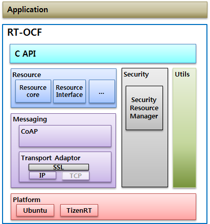

# RT-OCF


## Overview

The RT-OCF project is to develop an open source software framework which is a lightweight device-to-device (D2D) framework based on Open Connectivity Foundation (OCF) specification for IoT devices. RT-OCF targets [TizenRT](https://github.com/Samsung/TizenRT), a lightweight RTOS-based platform to support low-end IoT devices, and provides functionalities such as device discovery, create/read/update/delete operations of device resources, resource observation, and so on. All target functionalities of RT-OCF are not yet completed. For example, provisioning to cloud considering security together is underdeveloped.
The Charter of the RT-OCF Open Source Project is to create, develop and maintain open source technologies. 

The architecture of RT-OCF is as follows.



And key modules of RT-OCF shown in the above architecture are summarized as follows.

| Module        | Functionality |
| ------------- |-------------|
| Resource      | Resource/Request/Observe definition |
| Messaging     | Coap and transport layers      |
| Security | Acl2/cred/doxm/pstat handler      |
| Utils | Memory and data structure APIs      |

### Module

RT-OCF Module is a unit of the source code that accomplishes a specific objective, a subsystem of RT-OCF. Modules are established by the development community on as-need basis. They are hosted on the RT-OCF infrastructure, follow the rules of community and of development, and follow the coding guidelines established by the RT-OCF community. 

Each Module is led by the Reviewer and Maintainer. New Module can be suggested by any member of the Community, but the final decision on hosting said project rests with the Steering Committee. Modules that are no longer active are archived and do not have assigned Reviewers and Maintainers.


## Setup Preparation

To run `RT-OCF`, you need to install the package below.

1. Clone Tizen RT first and move to external directory.

```sh
# For TizenRT test
$ sudo pip install pyserial

## Setup development environment

$ git clone https://github.com/Samsung/TizenRT.git
$ cd external
```

2. Clone RT-OCF.

```sh
$ git clone https://github.com/Samsung/RT-OCF.git
```

3. Work within `external/RT-OCF`.

## How to Setup

For Setup RT-OCF options

```sh
os/linux$ make menuconfig
```

## How to build

### Linux

For Building RT-OCF with linux

**python script(recommended)**

```sh
$ ./tools/build.py linux -h
usage: build.py linux [-h] [--rebuild] [--ci]

Linux Build

optional arguments:
  -h, --help  show this help message and exit
  --rebuild   True, Build after clean
  --ci        True, if it is ci build.
```

**shell script**

```sh
$ tools/build_linux.sh
```

### TizenRT

For Building RT-OCF with TizenRT

**python script(recommended)**

```sh
$ ./tools/build.py tizenrt -h
usage: build.py tizenrt [-h] [--rebuild] [--config CONFIG] [--with-flash]
                        [--ci]

Tizen RT Build

optional arguments:
  -h, --help       show this help message and exit
  --rebuild        True, Build after clean
  --config CONFIG  Select the config you want to use for the TizenRT build.
  --with-flash     True, if you want to flash binary after building
  --ci             True, if it is ci build.
```

**shell script**

```sh
$ tools/build.py tizenrt

# artik053/zeroroot config
# If you want to build with RT-OCF, run this script.
$ tools/build_tizenrt_zeroroot.sh

# build TizenRT with specify config name
$ tools/build_tizenrt_with_configure.sh ${CONFIG_NAME}

# build TizenRT without configuration
# Use this script if you want to build the old configuration.
$ tools/build_tizenrt.sh ${CONFIG_NAME}
```

## How to test

### Linux

For Testing RT-OCF with linux

**python script(recommended)**

```sh
$ ./tools/test.py linux -h
usage: test.py linux [-h] [--rebuild] [--skip-build] [--cov] [--ci] [-v]
                     [-g GROUP] [-n NAME] [-c COUNT]

Linux Test

optional arguments:
  -h, --help            show this help message and exit
  --rebuild             True, Build after clean
  --skip-build          True, if you want to execute only test
  --cov                 True, If you want to calculate test coverage.
  --ci                  True, if it is ci build.
  -v, --verbose         Print test name before each test run
  -g GROUP, --group GROUP
                        Select a test group whose name contains the specified
                        string
  -n NAME, --name NAME  Select a test case whose name contains the specified
                        string
  -c COUNT, --count COUNT
                        Repeat the test for the specified number of times
```

**shell script**

```sh
$ tools/test_linux.sh
# Run specific test group
$ tools/test_linux.sh -g test_mem
# Run specific test name
$ tools/test_linux.sh -n getMemInfo_alloc_int_free_one
# Generate coverage report
$ tools/coverage_linux.sh
```

### TizenRT

For Testing RT-OCF with TizenRT

**python script**

```sh
$ ./tools/test.py tizenrt -h
usage: test.py tizenrt [-h] [--skip-build] [--rebuild] [--ci]

Tizen RT Test

optional arguments:
  -h, --help    show this help message and exit
  --skip-build  True, if you want to execute only test
  --rebuild     True, Build after clean
  --ci          True, if it is ci build.
```

## Flash to target board

Use the following commands to install the output binaries on the board (Artik053).

```sh
$ cd ../../os/
$ make download ALL
```

## Documentation

- [Governance and Community](docs/Governance.md)